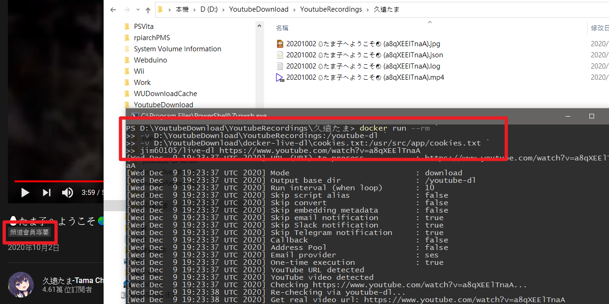

# live-dl on Docker
## 單次下載

```bash
docker run --rm
    -v D:\YoutubeDownload:/youtube-dl
    -v D:\YoutubeDownload\cookies.txt:/usr/src/app/cookies.txt
    jim60105/live-dl https://www.youtube.com/watch?v=GDOQTShjTQs
```

此格式如下\
將{{}}填入你的內容，若不需要登入就不用傳入cookies file
```bash
docker run --rm
    -v {{影片儲存資料夾}}:/youtube-dl
    -v {{cookies file，用於登入驗證}}:/usr/src/app/cookies.txt
    jim60105/live-dl {{Youtube網址}}
```

## 監視頻道
傳入channel網址，並以deamon執行\
可以傳入config設定檔，請參考 [config.yml](config.yml) 建立

```bash
docker run -d
    -v D:\YoutubeDownload:/youtube-dl
    -v D:\YoutubeDownload\config.yml:/usr/src/app/config.yml
    -v D:\YoutubeDownload\cookies.txt:/usr/src/app/cookies.txt
    jim60105/live-dl https://www.youtube.com/channel/UCBC7vYFNQoGPupe5NxPG4Bw
```

## docker-compose
請參考此專案: [jim60105/docker-live-dl](https://github.com/jim60105/docker-live-dl)

## 功能
- URL猜測：此腳本將盡最大努力猜測您傳遞給它的內容，以下URL / URI應該都可以工作:
  - https://www.youtube.com/channel/UC1opHUrw8rvnsadT-iGp7Cg/live
  - https://www.youtube.com/channel/UC1opHUrw8rvnsadT-iGp7Cg
  - https://www.youtube.com/watch?v=S3CAGeeMRvo
  - S3CAGeeMRvo
  - UC1opHUrw8rvnsadT-iGp7Cg
- 監視您喜愛的YouTube頻道，並在直播開始時下載串流
- 串流開始或完成下載時的Email/Slack通知
- 通過FFmpeg編寫影片metadata (作者/頻道名稱，描述，年份)

## 下載會員限定影片
此工具底層使用youtube-dl，而youtube-dl支援以cookie的方式登入
> youtube-dl的帳密功能**目前確定是壞的**，只能以cookies方式登入\
> 此cookies file包含了你的Youtube登入授權，請務必妥善保管
* 安裝瀏覧器擴充功能，以匯出Netscape HTTP Cookie File
  * Chrome: [Get cookies.txt](https://chrome.google.com/webstore/detail/get-cookiestxt/bgaddhkoddajcdgocldbbfleckgcbcid)
  * Firefox: [cookies.txt](https://addons.mozilla.org/zh-TW/firefox/addon/cookies-txt/)
* 瀏覧至Youtube網頁，登入你的帳號
* 以擴充功能匯出`youtube.com`網域的所有cookie
* 將匯出之cookie檔案重命名為`cookies.txt`
* 取代專案根目錄下的cookies.txt檔，或用於docker run時的volume bind

## 錄影完成Callback
如果需要在下載完成後回呼，請將回呼腳本bind至`/usr/src/app/callback.sh`

### callback.sh傳入之參數:
```
__info "Calling callback function..."
local cmd=( "$CALLBACK_EXEC" "${OUTPUT_PATH}.mp4" "$BASE_DIR/" "$VIDEO_ID" "$FULLTITLE" "$UPLOADER" "$UPLOAD_DATE" )
nohup "${cmd[@]}" &>> "$OUTPUT_PATH.log" &
```
bash參數:
1. 產出檔案的完整路徑
1. 產出檔案之所在資料夾
1. 影片id
1. 影片標題
1. 影片上傳者
1. 上傳日期
